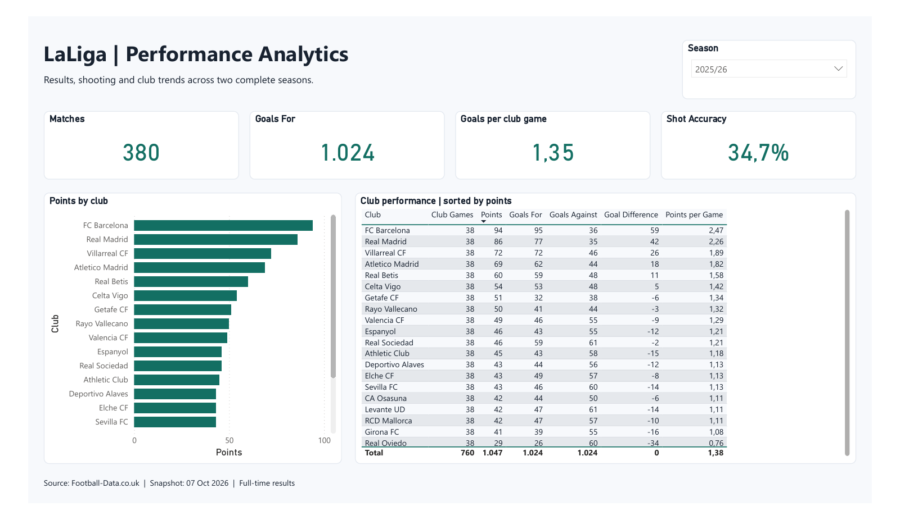
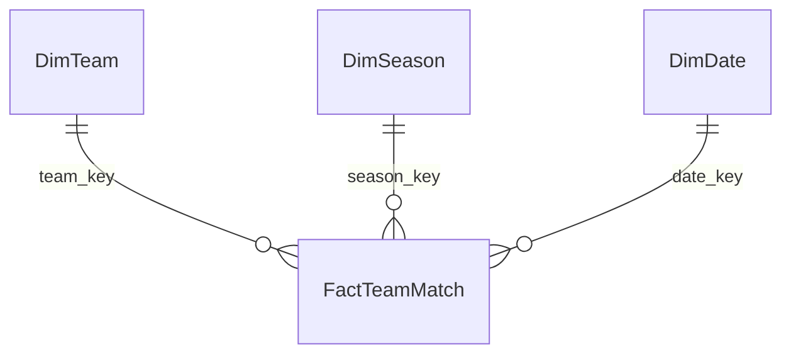

# LaLiga Performance Analytics

[](https://github.com/VictorSuicava/laliga-performance-analytics/actions/workflows/tests.yml)

A portfolio project exploring club performance in LaLiga across **2024/25 and 2025/26**, with Python, SQL and Power BI.

[GitHub repository](https://github.com/VictorSuicava/laliga-performance-analytics) · [Dashboard PDF](output/pdf/LaLiga.pdf) · [Analytical findings](docs/findings.md)

**Business question:** Which clubs improved or declined, and how did their results, shooting and home/away performance change?

**Intended user:** A performance analyst preparing a club season review.

## Current status

- Published as a public GitHub repository, with screenshots and a four-page dashboard PDF.
- Python ingestion and validation pipeline: implemented.
- GitHub Actions runs the seven business regression tests on Windows and Linux with Python 3.10 and 3.13. Tests use deterministic fixtures and do not download external data.
- SQLite star schema, analytical SQL views and Power BI CSV exports: implemented.
- Power Query scripts, DAX measures and four report pages: implemented and opened in Power BI Desktop.
- Power BI report: `powerbi/LaLigaPortfolio.pbix`, with the data loaded locally.
- Editable source project: `powerbi/LaLiga.pbip` and its PBIR report definitions.
- DAX reconciliation: 40 club-season aggregates, 80 club-venue aggregates and 17 season comparisons passed. See [the validation record](docs/powerbi_validation.json).
- Three descriptive findings: [analytical write-up](docs/findings.md).



The local PBIX and PDF are generated artifacts. The source project, screenshots and code provide the GitHub portfolio view; there is no hosted Power BI Service demo yet.

## Explore the report

Open `powerbi/LaLigaPortfolio.pbix` in Power BI Desktop. Start on League overview, then inspect Club diagnosis, Attack and defence, and Season comparison. The default season is 2025/26; the club diagnosis starts with FC Barcelona.

The [learning path](docs/learning_path.md) explains how to inspect the model, read the measures and make your first Power BI changes.

For a static view, open the [four-page PDF](output/pdf/LaLiga.pdf). Its tables and charts show the visible portion of the interactive visuals; use the PBIX to scroll or filter the full dataset. Desktop regional settings can affect date labels and numeric separators.

| Page | What it helps answer |
|---|---|
| [League overview](docs/images/laliga-1.png) | How do club results compare within a season? |
| [Club diagnosis](docs/images/laliga-2.png) | How did one club accumulate points, at home and away? |
| [Attack and defence](docs/images/laliga-3.png) | How do shooting volume, accuracy and conversion compare? |
| [Season comparison](docs/images/laliga-4.png) | Which returning clubs gained or lost points? |

## Selected findings

- **Getafe:** points rose from 42 to 51 while shots per game fell from 11.42 to 9.24.
- **Athletic Club:** points fell from 70 to 45; goals conceded rose from 29 to 58.
- **Barcelona:** a six-point overall gain combined a 14-point home gain with an eight-point away decline.

These are descriptive observations, not causal explanations. Read the [findings and reproducible SQL](docs/findings.md) for context and limitations.

The [interview guide](docs/interview_guide.md) provides a two-minute walkthrough and questions about modelling and validation. The [publication guide](docs/github_publication.md) covers repository presentation, cloning and shareable artifacts.

Generate a publication archive with `python scripts/package_portfolio.py`. It includes the source, documentation and static previews; the local PBIX, downloaded datasets and machine-specific semantic model are excluded.

## Run locally

Requires Python 3.10 or later. There are no third-party Python dependencies.

```powershell
cd laliga-performance-analytics
python scripts/pipeline.py
python -m unittest discover -s tests -v
python scripts/build_powerbi.py
```

The pipeline's first run downloads both source CSVs. Later runs reuse these snapshots. On a fresh checkout, the report builder creates the local semantic model and preserves the included report definitions. Open the PBIP in Desktop and refresh to load the CSVs. If a local semantic model already exists, the builder refuses to replace it unless `--overwrite` is explicitly supplied; that option also replaces report edits.

The generated semantic model contains the local DataFolder path and is excluded from Git. Rebuild it when cloning the project onto another machine. Desktop can save the resulting PBIP as PBIX.

To deliberately download a newer data snapshot:

```powershell
python scripts/pipeline.py --refresh
```

Outputs:

- `data/raw/`: original CSV snapshots and download metadata.
- `data/warehouse/laliga.sqlite`: SQL database with dimensions, facts and analytical views.
- `data/processed/`: seven CSVs, including four tables for the Power BI model.
- `docs/quality_report.json`: source URLs, download times, hashes, coverage and validation results.

Follow [the Power BI guide](docs/powerbi_setup.md) to recreate the model manually as a learning exercise. See [the analytical brief](docs/project_brief.md), [data dictionary](docs/data_dictionary.md) and [metric definitions](docs/metrics.md).

## Data model



The report fact grain is **one club in one match**, not one match. Each fixture has exactly two perspectives. Distinct match counts and club appearance counts are deliberately different measures.

## Data sources and scope

Source: [Football-Data.co.uk — Spain](https://www.football-data.co.uk/spainm.php), with [field definitions](https://www.football-data.co.uk/notes.txt).

- [2024/25 CSV](https://www.football-data.co.uk/mmz4281/2425/SP1.csv)
- [2025/26 CSV](https://www.football-data.co.uk/mmz4281/2526/SP1.csv)

Each complete season must contain 380 fixtures and 20 clubs with 19 home and 19 away games each. Source files may receive corrections; hashes identify the snapshots used.

This version uses results, shots, shots on target, corners, fouls and cards. It does not contain xG, player-level data, shot coordinates, possession or official matchday labels. Match chronology is not an official round number. Odds columns are excluded from the analytical model.

Raw and generated datasets are excluded from Git by default. Source attribution is provided here; no unrestricted data redistribution license is asserted. The code can be shared independently from the downloaded source files.

## Interpretation limits

- Shooting volume is not a direct measure of chance quality.
- Goal conversion includes all full-time goals, including own goals, and is not a pure player finishing measure.
- Associations between shots, cards and results do not establish causality.
- Cross-season changes are calculated only for clubs present in both seasons.
- The project does not reconstruct LaLiga's official tie-breaking rules or disciplinary points deductions.

## Roadmap

1. Evaluate a separate xG source, its coverage and match linkage before integration.
2. Add a temporally evaluated prediction model as a later data science extension.

